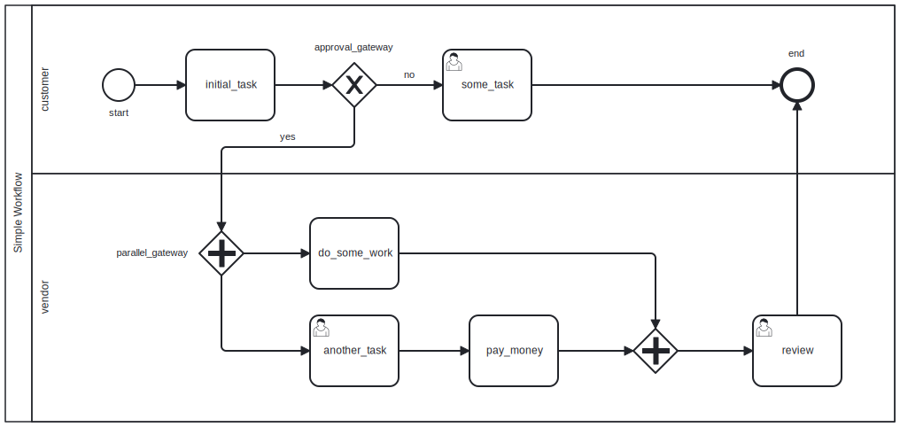

# Simple Workflow Microservice

This repository has an example of creating a simple workflow microservice with [NestJS](https://github.com/nestjs/nest) and [WorkflowJS](https://github.com/vhidvz/workflow-js).

# Diagram



# Up and Running

First of all need to clone this repository by following command.

```sh
git clone https://github.com/vhidvz/workflow-template.git
```

Then install the node dependencies with command `cd workflow-template && npm ci`. after that, install the MongoDB community server by the following command in your terminal.

```sh
docker-compose up -d
```

To start and run the project type `npm run start`, that's it...

# Usage and Dangling

Swagger UI is also exists and running on [http://[::1]:3000/api](http://[::1]:3000/api)

## Senario 1: Not Approval Service Request

### _Step 1_

Create a flow by posting a request with plain data `Hi`.

```sh
curl --request POST \
  --url http://localhost:3000/flow \
  --header 'Content-Type: application/json' \
  --data '{
  "global": "Hi"
}'
```

__Response:__ base on the flow definition exclusive gateway `approval_gateway` cannot automatically done, therefor workflow will pauses at this point.

```json
{
  "data": {
    "global": "Hi",
    "_id": "643fcfe30eaf231a283a539b"
  },
  "status": "paused",
  "tokens": [
    {
      "id": "cc5c8c5baa370eec",
      "histories": [
        {
          "status": "completed",
          "ref": "StartEvent_0do01j4",
          "name": "start"
        },
        {
          "status": "completed",
          "ref": "Activity_0mra47f",
          "name": "initial_task"
        },
        {
          "status": "paused",
          "ref": "Gateway_0az0yjr",
          "name": "approval_gateway"
        }
      ]
    }
  ],
  "_id": "643fcfe30eaf231a283a539a",
  "__v": 0
}
```

### _Step 2_

Find a flow by mongo id with the following `GET` request.

```sh
curl --request GET \
  --url http://localhost:3000/flow/643fcfe30eaf231a283a539a
```

__Response:__ it must be same as the previous result.

### _Step 3_

Resume the flow by posting a `PATCH` request with `no` response by user.

```sh
curl -X 'PATCH' \
  'http://[::1]:3000/flow/643fcfe30eaf231a283a539a/approval_gateway' \
  -H 'accept: application/json' \
  -H 'Content-Type: application/json' \
  -d '{
  "local": "no"
}'
```

__Response:__ because of `some_task` is a user task at this state based on [diagram](#diagram) we need to pause flow, there for another request needed to complete this task.

```json
{
  "_id": "643fcfe30eaf231a283a539a",
  "data": {
    "global": "Hi, Hello no!",
    "_id": "643fcfe30eaf231a283a539b"
  },
  "status": "paused",
  "tokens": [
    {
      "id": "cc5c8c5baa370eec",
      "histories": [
        {
          "ref": "StartEvent_0do01j4",
          "status": "completed",
          "value": null,
          "name": "start"
        },
        {
          "ref": "Activity_0mra47f",
          "status": "completed",
          "value": null,
          "name": "initial_task"
        },
        {
          "ref": "Gateway_0az0yjr",
          "status": "completed",
          "value": {
            "local": "no"
          },
          "name": "approval_gateway"
        },
        {
          "ref": "Activity_1v0hfx6",
          "status": "paused",
          "value": null,
          "name": "some_task"
        }
      ]
    }
  ],
  "__v": 0
}
```

### _Step 4_

Finishing flow by resuming task `some_task`.

```sh
curl -X 'PATCH' \
  'http://[::1]:3000/flow/643fcfe30eaf231a283a539a/some_task' \
  -H 'accept: application/json' \
  -H 'Content-Type: application/json' \
  -d '{
  "local": "done"
}'
```

__Response:__ status of context is terminated and could not resume again.

```json
{
  "_id": "643fcfe30eaf231a283a539a",
  "data": {
    "global": "Hi, Hello no!, received a value from previous task(some value(done) to end event.)",
    "_id": "643fcfe30eaf231a283a539b"
  },
  "status": "terminated",
  "tokens": [
    {
      "id": "cc5c8c5baa370eec",
      "histories": [
        {
          "ref": "StartEvent_0do01j4",
          "status": "completed",
          "value": null,
          "name": "start"
        },
        {
          "ref": "Activity_0mra47f",
          "status": "completed",
          "value": null,
          "name": "initial_task"
        },
        {
          "ref": "Gateway_0az0yjr",
          "status": "completed",
          "value": {
            "local": "no"
          },
          "name": "approval_gateway"
        },
        {
          "ref": "Activity_1v0hfx6",
          "status": "completed",
          "value": {
            "local": "done"
          },
          "name": "some_task"
        },
        {
          "ref": "Event_13pwumb",
          "status": "terminated",
          "value": {
            "local": "some value(done) to end event."
          },
          "name": "end"
        }
      ]
    }
  ],
  "__v": 0
}
```
